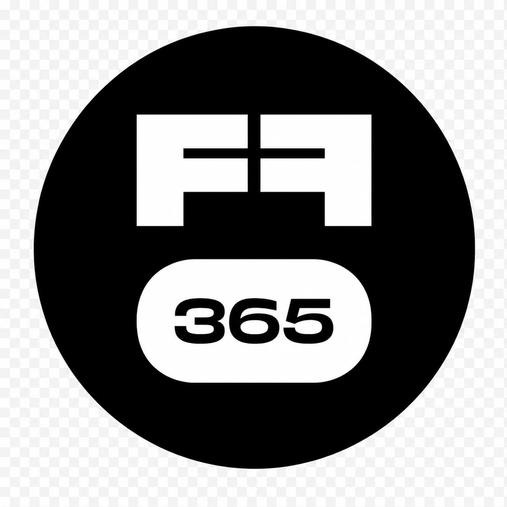

<div align="center">

[](https://git.io/typing-svg)

<p align="center">
  <a href="https://t.me/TakuyaYagam1">
    
  </a>
  &nbsp;&nbsp;
  <a href="mailto:i.dubetskiy.w@gmail.com">
    
  </a>
  &nbsp;&nbsp;
  <a href="https://standoff365.com/profile/TakuyaYagam1/">
    
  </a>
</p>

</div>

---

<div align="center">

[](https://git.io/typing-svg)

</div>

```go
package main

type Takuya struct {
    OS        []string
    Languages Languages
    Stack     Stack
    Security  []string
}

type Languages struct {
    Main      []string
    Secondary []string
}

type Stack struct {
    Backend    []string
    Databases  []string
    Brokers    []string
    DevOps     []string
    Monitoring []string
    Other      []string
}

var me = Takuya{
    OS: []string{"NixOS"},
    Languages: Languages{
        Main:      []string{"Go", "Python"},
        Secondary: []string{"TypeScript", "C/C++"},
    },
    Stack: Stack{
        Backend:    []string{"go-chi", "FastAPI", "gRPC", "WebSocket"},
        Databases:  []string{"PostgreSQL", "MySQL", "Redis", "MongoDB"},
        Brokers:    []string{"RabbitMQ", "Apache Kafka", "NATS"},
        DevOps:     []string{"Docker", "Kubernetes", "GitLab CI/CD", "GitHub Actions"},
        Monitoring: []string{"Grafana", "Loki", "Prometheus"},
        Other:      []string{"Git", "ROS", "MinIO", "SeaweedFS", "ODM"},
    },
    Security: []string{
        "CTF (Attack/Defense) enjoyer",
        "Bug bounty hunter",
        "Team: o1d_bu7_go1d",
    },
}
```

---

<div align="center">

[](https://git.io/typing-svg)

<a href="http://www.github.com/TakuyaYagam1"></a>

<a href="http://www.github.com/TakuyaYagam1"></a>

<a href="https://github.com/TakuyaYagam1"></a>


</div>
